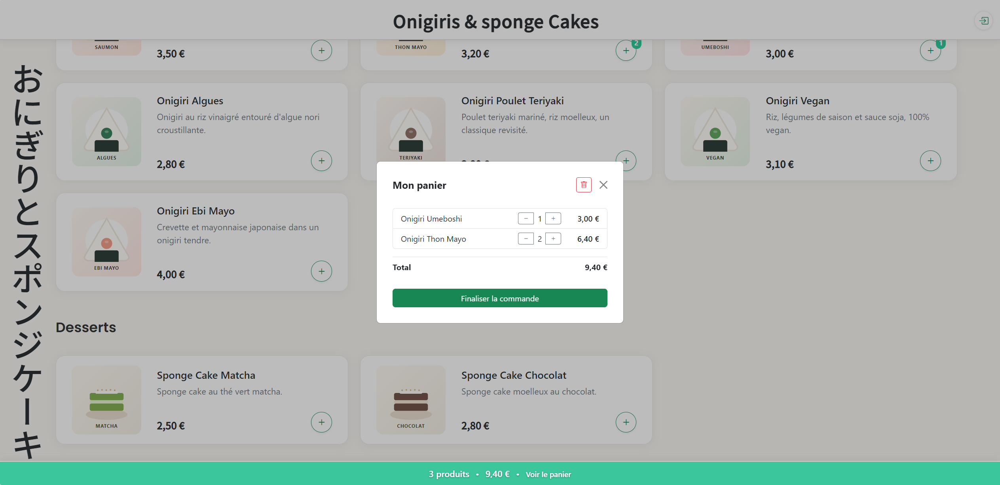
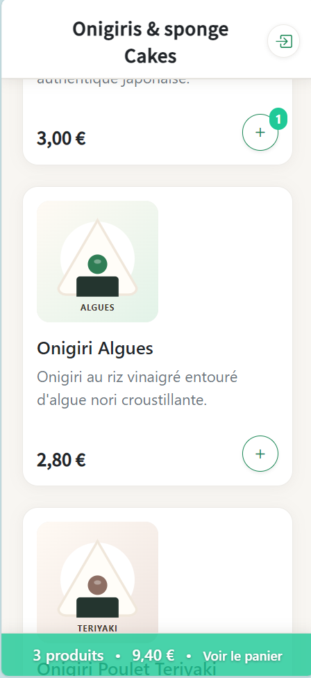
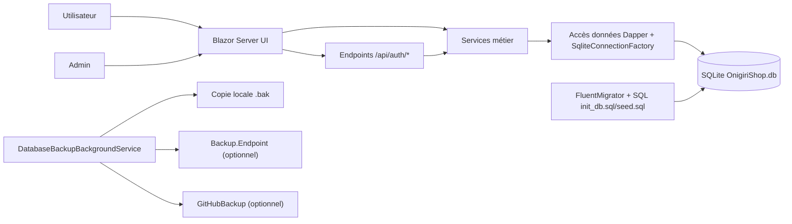

# OnigiriShop
Application e-commerce de démonstration en Blazor Server pour catalogue, panier, commande et back-office.

[](https://github.com/arnaud-wissart/OnigiriShop/actions/workflows/dotnet.yml)
[](./LICENSE)

## Démo live
- URL: https://onigirishop.onrender.com/
- Releases: [GitHub Releases](https://github.com/arnaud-wissart/OnigiriShop/releases)

## Ce que ça démontre
- Développement d'une application Blazor Server orientée usage métier (catalogue, panier, validation de commande).
- Back-office complet avec routes dédiées: `/admin`, `/admin/products`, `/admin/users`, `/admin/deliveries`, `/admin/stats`, `/admin/emails`, `/admin/logs`, `/admin/invite`.
- Implémentation d'une API minimale d'authentification (`/api/auth/login`, `/api/auth/logout`, `/api/auth/refresh`, `/api/auth/forgot-password`, `/api/auth/request-access`).
- Architecture claire (services métier dédiés + accès SQLite via `SqliteConnectionFactory`/Dapper).
- Gestion de la base via migrations FluentMigrator (scripts `SQL/init_db.sql` et `SQL/seed.sql` embarqués).
- Mécanisme de sauvegarde automatique de base (`.bak`) avec options de backup HTTP et GitHub.
- Qualité logicielle avec tests unitaires xUnit et tests E2E Playwright, exécutés en CI GitHub Actions.

## Captures

<p align="center">
  
  
</p>

## Architecture


## Stack technique
- Back-end: ASP.NET Core / Blazor Server (`net8.0`), Dapper (`2.1.66`), FluentMigrator.Runner (`8.0.1`), SQLite (`Microsoft.Data.Sqlite 10.0.3`).
- Front-end: Bootstrap (`5.3.8`), Bootstrap Icons (`1.13.1`), FullCalendar (`6.1.19`), Quill (`2.0.3`), Chart.js (`4.5.0`), Flatpickr (`4.6.13`) via LibMan.
- Observabilité: Serilog (`Serilog.AspNetCore 10.0.0` + fichier `onigiri_init.log`).
- Tests: xUnit (`2.9.3`), Moq (`4.20.72`), Playwright (`1.58.0`).
- CI: GitHub Actions ([`.github/workflows/dotnet.yml`](.github/workflows/dotnet.yml)).
- Conteneurisation: [`Dockerfile`](Dockerfile) .NET 8 (build/publish + runtime ASP.NET).

## Démarrage rapide (dev local)
Prérequis:
- SDK .NET 8
- LibMan CLI

```powershell
git clone https://github.com/arnaud-wissart/OnigiriShop.git
cd OnigiriShop/src/OnigiriShop
dotnet tool install -g Microsoft.Web.LibraryManager.Cli
libman restore
dotnet restore
dotnet run
```

URLs locales par défaut (profil `OnigiriShop`): `https://localhost:7076` et `http://localhost:5148`.

## Tests
Unitaires:
```powershell
dotnet test tests/Tests.Unit/Tests.Unit.csproj -c Release
```

E2E (Playwright):
```powershell
dotnet build OnigiriShop.sln -c Release
pwsh tests/Tests.Playwright/bin/Release/net8.0/playwright.ps1 install --with-deps
dotnet test tests/Tests.Playwright/Tests.Playwright.csproj -c Release
```

Intégration:
- `TODO` (aucun projet de tests d'intégration dédié détecté dans le dépôt).

CI (pipeline complet):
```powershell
dotnet restore OnigiriShop.sln
dotnet build OnigiriShop.sln --no-restore --configuration Release
pwsh tests/Tests.Playwright/bin/Release/net8.0/playwright.ps1 install --with-deps
dotnet test OnigiriShop.sln --no-build --configuration Release
```

## Sécurité & configuration
Variables d'environnement explicites dans le code:

| Variable | Usage | Exemple |
|---|---|---|
| `ONIGIRISHOP_DB_PATH` | Redéfinit le chemin du fichier SQLite (`DatabasePaths.GetPath`) | `<ABSOLUTE_DB_PATH>/OnigiriShop.db` |
| `ASPNETCORE_ENVIRONMENT` | Environnement d'exécution (`Development` en local/tests) | `Development` |
| `ASPNETCORE_URLS` | URL d'écoute du processus .NET (Docker CMD) | `http://+:<PORT>` |
| `PORT` | Port injecté par la plateforme de déploiement (Docker CMD) | `<PORT>` |

Configuration applicative (sans valeurs réelles):
```powershell
dotnet user-secrets set "Mailjet:ApiKey" "<MAILJET_API_KEY>"
dotnet user-secrets set "Mailjet:ApiSecret" "<MAILJET_API_SECRET>"
dotnet user-secrets set "Mailjet:SenderEmail" "<SENDER_EMAIL>"
dotnet user-secrets set "Mailjet:SenderName" "<SENDER_NAME>"
dotnet user-secrets set "Mailjet:AdminEmail" "<ADMIN_EMAIL>"
dotnet user-secrets set "Backup:Endpoint" "<BACKUP_ENDPOINT_URL>"
dotnet user-secrets set "GitHubBackup:Token" "<GITHUB_TOKEN>"
dotnet user-secrets set "GitHubBackup:Owner" "<GITHUB_OWNER>"
dotnet user-secrets set "GitHubBackup:Repo" "<GITHUB_REPO>"
dotnet user-secrets set "GitHubBackup:FilePath" "OnigiriShop.db"
dotnet user-secrets set "GitHubBackup:Branch" "main"
```

Notes:
- Ne jamais committer de secrets dans `appsettings.json`, `appsettings.*.json` ou les scripts CI.
- Le détail exploitation/déploiement est centralisé dans [`docs/RUNBOOK.md`](docs/RUNBOOK.md).
- `TODO`: durcir la politique cookie en production (`CookieSecurePolicy.None` est commenté dans `AuthConfig`).

## Licence
Ce projet est distribué sous licence [MIT](LICENSE).
